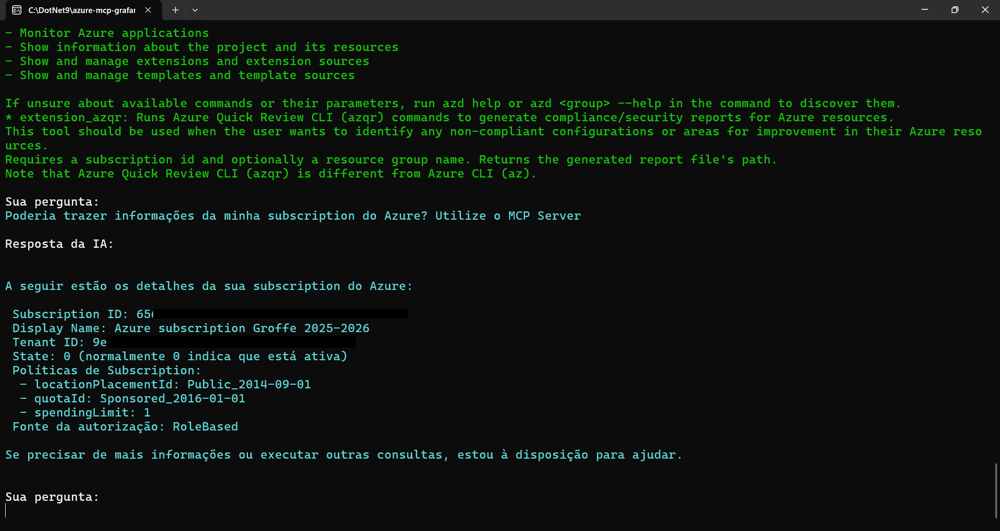
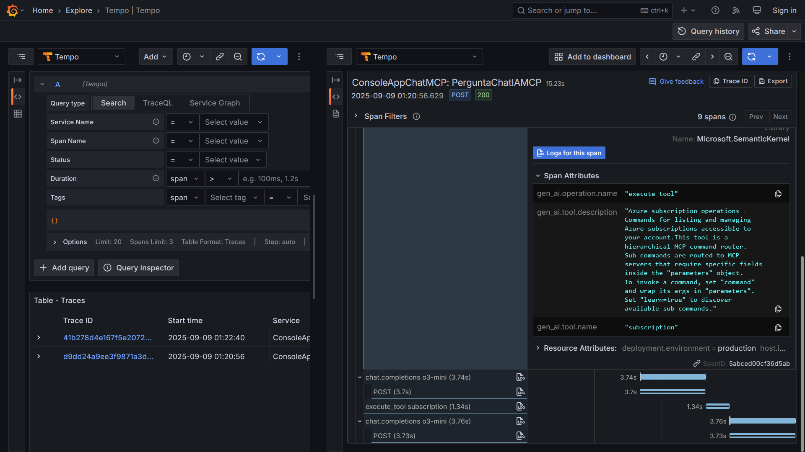
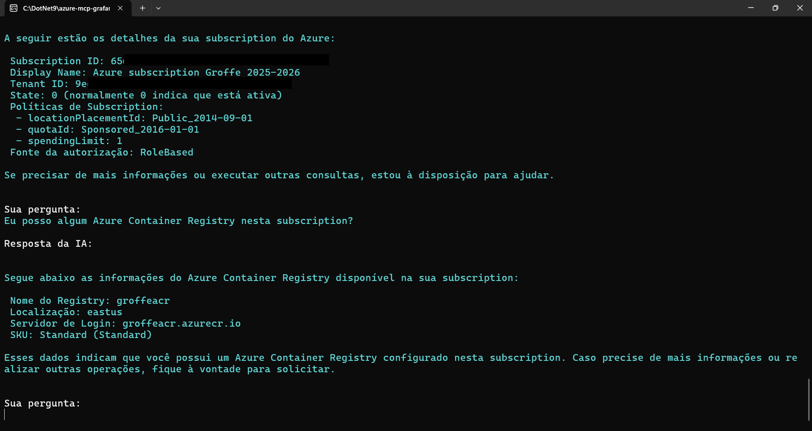
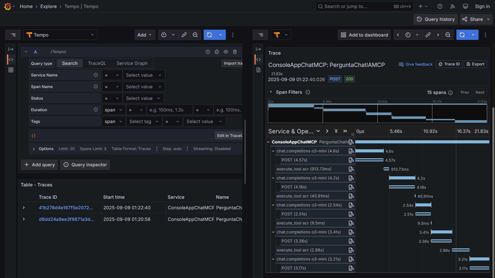

# dotnet9-semantickernel-otel-grafana-mcp-azure-npm_chat
Exemplo em .NET 9 de Console Application que faz uso do projeto Semantic Kernel, com integração com soluções de IA como Azure Open AI e Ollama na interação com um servidor MCP - utilizei o Azure MCP para testes (package npm). Inclui Docker Compose para criação do ambiente de testes com os serviços de monitoramento do Grafana + OpenTelemetry.

---

## Exemplos de uso

Consultando informações sobre a subscription do Azure:

Resultado no Grafana:

Consultando informações sobre um recurso Azure Container Registry (ACR):

E o resultado da instrumentação no Grafana:

